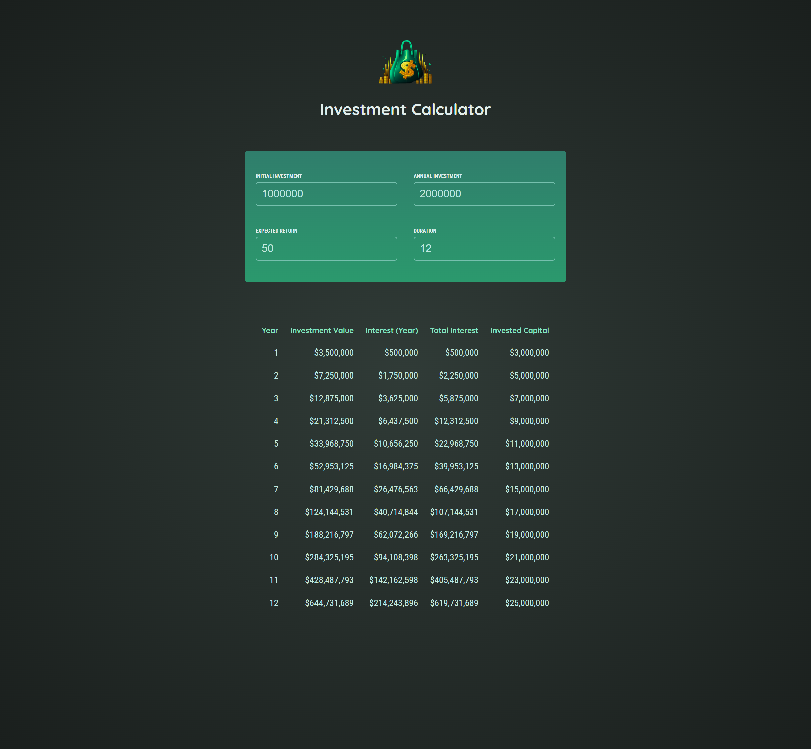

# Investment Calculator

This project is a simple **Investment Calculator** built using **React**. It helps users estimate the growth of their investments over time based on initial investment, annual contributions, expected return rate, and duration.

## Table of Contents

- [About the Project](#about-the-project)
- [Features](#features)
- [Technologies Used](#technologies-used)
- [Installation](#installation)
- [Usage](#usage)
- [Contributing](#contributing)
- [License](#license)
- [Screenshot](#screenshot)

## About the Project

The **Investment Calculator** allows users to project the future value of their investments. By entering key financial parameters, users receive a detailed breakdown of investment growth over time.



## Features

- **Dynamic Input Fields**: Users can enter:
  - Initial investment amount
  - Annual investment contributions
  - Expected annual return rate
  - Investment duration (in years)
- **Real-Time Calculations**: Instantly computes and displays:
  - Yearly investment value
  - Interest earned per year
  - Total interest accumulated
  - Total invested capital
- **User-Friendly Interface**: Simple and intuitive UI for easy navigation.
- **Responsive Design**: Works across various screen sizes.

## Technologies Used

- **React.js**: Used for the frontend and state management.
- **CSS**: For styling the UI.
- **JavaScript**: Core language for logic and financial computations.

## Installation

To set up the project locally, follow these steps:

1. Clone the repository:
   ```sh
   git clone https://github.com/your-username/investment-calculator.git
   cd investment-calculator
   ```
2. Install dependencies:
   ```sh
   npm install
   ```
3. Start the development server:
   ```sh
   npm run dev
   ```
4. Open your browser and visit `http://localhost:5173/`

## Usage

1. Enter the **initial investment amount**.
2. Specify the **annual investment amount**.
3. Set the **expected return percentage**.
4. Define the **investment duration in years**.
5. View a detailed breakdown of how your investment grows over time.

## Contributing

We welcome contributions! If you'd like to improve the project:

1. **Fork** the repository.
2. **Create a new branch** (`git checkout -b feature-name`).
3. **Commit your changes** (`git commit -m 'Added new feature'`).
4. **Push to the branch** (`git push origin feature-name`).
5. **Open a pull request** and describe your changes.

## License

This project is open source and available under the **MIT License**.

## Screenshot


